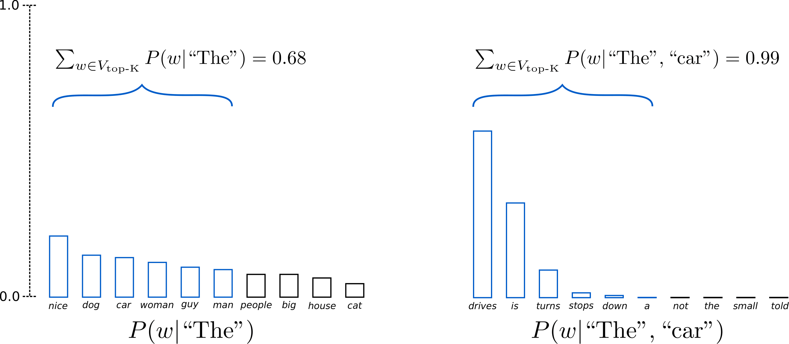

# 大模型训练

# 支持模型

- [Baichuan7B/13B](https://github.com/baichuan-inc/Baichuan-7B)
- [Moss16B](https://github.com/OpenLMLab/MOSS)
- [ChatGLM/ChatGLM2](https://github.com/THUDM/ChatGLM-6B)

# 支持训练方法

## SFT

- Full parameter tuning
- [LoRA](https://arxiv.org/abs/2106.09685)
- [QLoRA](https://arxiv.org/abs/2305.14314)

# 支持训练数据集

```需要将数据下载到本地读取```

## SFT-Datasets

- [Belle_open_source_500k](https://huggingface.co/datasets/BelleGroup/train_0.5M_CN/blob/main/Belle_open_source_0.5M.json)```单轮对话```：包含约50万条由[BELLE](https://github.com/LianjiaTech/BELLE)项目生成的中文指令数据。
- [Firefly-train-1.1M](https://huggingface.co/datasets/YeungNLP/firefly-train-1.1M)```单论对话```：23种常见的中文NLP任务的数据，并且构造了许多与中华文化相关的数据，如对联、作诗、文言文翻译、散文、金庸小说等。对于每个任务，由人工书写若干种指令模板，保证数据的高质量与丰富度，数据量为115万

- [Moss-003-sft-data](https://huggingface.co/datasets/YeungNLP/moss-003-sft-data)```多论对话```：由复旦大学MOSS团队开源的中英文多轮对话数据，包含100万+数据

- [Safety-prompts](https://github.com/thu-coai/Safety-Prompts)```单论对话```：包括100k条中文安全场景的prompts和ChatGPT的回复，涵盖了各类安全场景和指令攻击，可以用于全面评测和提升模型的安全性，也可以用于增强模型关于安全方面的知识，对齐模型输出和人类价值观。

  

# **解析**

Instruction tuning: Causal Language Model的语言生成过程


# 文本生成策略

```图片源自```[Huggingface blog](https://huggingface.co/blog/how-to-generate)

```python
generation_config = GenerationConfig(
        temperature=0.6,
        top_p=0.8,
        do_sample=True,
        repetition_penalty=2.0,
        max_new_tokens=512,  # max_length=max_new_tokens+input_sequence
    )
generate_ids = model.generate(**inputs, generation_config=generation_config)
output = tokenizer.decode(generate_ids[0][len(inputs.input_ids[0]):])
```

## Greedy Search

贪心搜索每一步都只考虑当前的最优解，它容易陷入局部最优解。如果全局最优解在当前时刻的token的对应于一个比较低的概率，那么Greedy Search无法探索这些概率较低的路径。如下图，Greedy Search每一步只考虑当前最优计算得到的句子**The nice woman**的概率为**0.5✖0.4=0.2**，而另一个序列**The dog has**的概率是**0.4✖0.9=0.36**。

​                                   

## Beam Search

束搜索与Greedy Search类似，不同的是，束搜索每一步只考虑当前时刻token概率大小前Beamsize个的结果，即每一步保留固定数量的候选序列。Beam Search 生成的结果通常会缺乏多样性，处理较长的序列时，Beam Search 的空间复杂度会随着候选集大小和序列长度的增加而增加。

​                                      

## Top K Sampling 

Top K Sampling的文本生成方式就是从token的概率分布中进行采样，为了防止随机采样到一些概率极小的生僻词，选择从概率大小Top K的分布中进行采样。比如选择K=6，那么每一次生成新的token只会从由6个token构成的概率分布中采样得到，这种方式生成的文本内容就更加丰富。



## Top P Sampling

Top P Sampling是从累积概率超过概率p的最少的单词集合中进行采样，集合中单词的概率将会重新进行调整，因此每一个时刻模型采样的单词集合是不固定的。


# 微调前后效果对比

为方便比较，本实验在Safetyprompts数据集上选择了三个领域**偏见歧视、违法犯罪、道德伦理**共30000条数据进行**QLoRA**微调。

## Baichuan13B base vs Baichuan 13B-sft


# 未来计划

- [ ] Reward Model Trainig
- [ ] RLHF Training
- [ ] Model  --->  ONNX
- [ ] C++  Inference Implementation